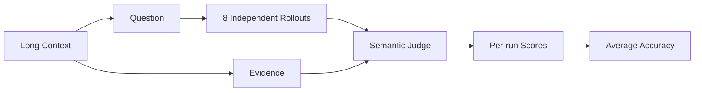

<p align="center">
  
</p>

<h1 align="center">Long Context QA · Curated 20</h1>

<p align="center">
  面向长文档检索、跨段证据整合与结构化推理的精选问答数据集<br/>
  <em>A compact, inspectable benchmark for long-context question answering.</em>
</p>

<p align="center">
  
  
  
  
  
</p>

---

## ✨ 数据集亮点

| | 特性 | 说明 |
|---|---|---|
| 🧠 | **真实长上下文** | 8k—256k长度桶，覆盖局部检索、跨章节聚合、时序重建与数值推理 |
| 🎯 | **精选20题** | 15道简答题 + 5道选择题，纳入源数据中全部有效选择题 |
| 🌏 | **双语均衡** | 中文10题、英文10题 |
| 🧪 | **可复核难度** | 每题保留8次独立rollout、原始回答、评分与裁判过程 |
| 🔗 | **证据可追溯** | 每条记录关联独立context文件、来源链接与答案证据 |
| ✅ | **机器可验证** | 提供零依赖校验脚本，检查JSONL、文件映射、ID、题型与rollout |

## 📊 数据概览

| 指标 | 数值 |
|---|---:|
| 精选题目 | **20** |
| 简答 / 选择 | **15 / 5** |
| 中文 / 英文 | **10 / 10** |
| 独立rollout | **160** |
| 整体平均正确率 | **14.37%** |
| 长度桶 | **8k · 16k · 32k · 64k · 128k · 256k** |
| 覆盖领域 | **软件工程、金融、学术、法律、政府事务、新闻** |

<details>
<summary><strong>查看领域分布</strong></summary>

| 领域 | 题数 |
|---|---:|
| 软件与工程 | 6 |
| 金融 | 5 |
| 法律 | 3 |
| 政府事务 | 3 |
| 学术 | 2 |
| 新闻 | 1 |

</details>

## 🧭 评测链路



## 🗂️ 仓库结构

```text
.
├── assets/                         # README视觉素材
├── configs/                        # 三批rollout配置
├── contexts/                       # 20份长上下文原文
├── data/
│   ├── long_context_qa_curated_20.jsonl
│   ├── dataset_card.json
│   └── index.csv
├── docs/
│   └── selection-report.md         # 逐题精选清单
├── rollouts/                       # 每题8轮回答、评分与裁判
├── scripts/
│   └── validate_dataset.py
└── README.md
```

## 🚀 快速开始

### 读取数据

```python
import json
from pathlib import Path

path = Path("data/long_context_qa_curated_20.jsonl")
records = [json.loads(line) for line in path.read_text(encoding="utf-8").splitlines()]

print(f"records: {{len(records)}}")
print(records[0]["question"])
print(records[0]["answer"])
```

### 运行完整校验

```bash
python3 scripts/validate_dataset.py
```

成功时输出：

```text
PASS · 20 records · 20 contexts · 160 rollouts
```

## 🧩 核心字段

| 字段 | 类型 | 含义 |
|---|---|---|
| `track_id` | string | 稳定题目ID |
| `context_id` | string | 长上下文ID |
| `context` | string | 完整上下文文本 |
| `question_type` | string | 短答案题、选择题或多项选择题 |
| `question` | string | 问题及输出约束 |
| `answer` | array | 标准答案 |
| `answer_explanation` | object | 解题步骤与证据 |
| `review_result` | object | 内容质量审查 |
| `difficulty_result` | object | 8轮回答、逐轮评分与平均结果 |
| `task_labels` | object | 主任务、次任务、上下文需求等级 |

## 🏅 精选策略

- 排除源包中已明确标记为**证据不足**或**答案不唯一**的题目。
- 相同context只保留一道题，降低重复度。
- 纳入源数据中全部5道有效选择题。
- 在剩余题目中平衡语言、领域、长度桶与任务类型。
- 保留原`track_id`与`context_id`，便于回溯。
- 修正`000026`的JSON标准答案和`000037`的题型元数据。

完整记录见 [精选题清单](docs/selection-report.md)。

## 🔍 单条记录示例

```json
{{
  "track_id": "longqa_delivery_000001",
  "context_id": "context_000001",
  "question_type": "短答案题",
  "language": "Chinese",
  "domain": "软件与工程",
  "token_length": 8488,
  "file_path": "contexts/context_000001.txt",
  "question": "...",
  "answer": ["..."],
  "review_result": {{"status": "pass"}},
  "difficulty_result": {{"rollout_count": 8}}
}}
```

## 🛠️ 已修订记录

| ID | 修订内容 |
|---|---|
| `000026` | 标准答案改成题干指定的`[Answer]` + JSON数组结构 |
| `000037` | `question_type`由“短答案题”修正为“选择题” |

## 📌 使用说明

完整数据集共 **10,000条**，本仓库从中精选 **20条高质量样例**，用于展示数据格式、任务类型、长上下文推理难度及完整评测流程。

---

<p align="center">
  <strong>Built for inspectable long-context evaluation.</strong><br/>
  Context → Evidence → Reasoning → Answer
</p>
